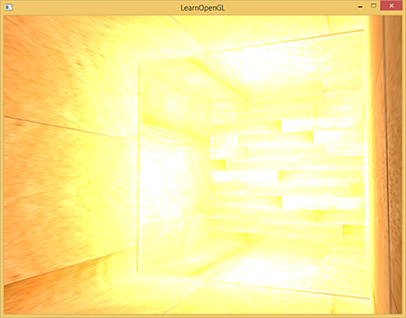
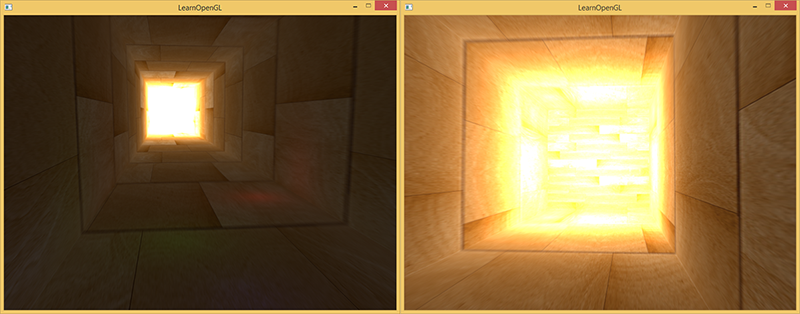
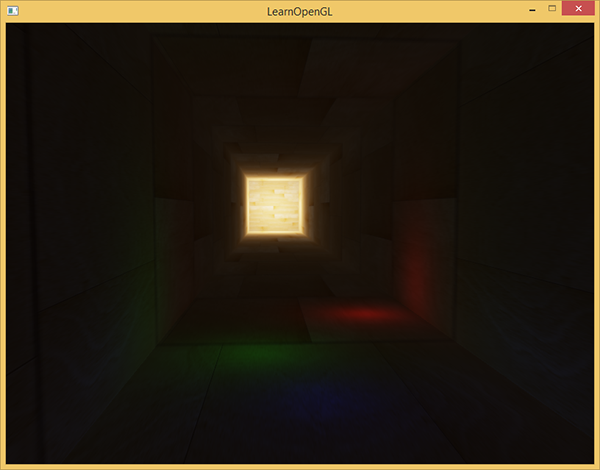

# HDR

原文     | [HDR](http://learnopengl.com/#!Advanced-Lighting/HDR)
      ---|---
作者     | JoeyDeVries
翻译     | Krasjet
校对     | 暂无

!!! note

	本节暂未进行完全的重写，错误可能会很多。如果可能的话，请对照原文进行阅读。如果有报告本节的错误，将会延迟至重写之后进行处理。

一般来说，当存储在帧缓冲(Framebuffer)中时，亮度和颜色的值是默认被限制在0.0到1.0之间的。这个看起来无辜的语句使我们一直将亮度与颜色的值设置在这个范围内，尝试着与场景契合。这样是能够运行的，也能给出还不错的效果。但是如果我们遇上了一个特定的区域，其中有多个亮光源使这些数值总和超过了1.0，又会发生什么呢？答案是这些片段中超过1.0的亮度或者颜色值会被约束在1.0，从而导致场景混成一片，难以分辨：



这是由于大量片段的颜色值都非常接近1.0，在很大一个区域内每一个亮的片段都有相同的白色。这损失了很多的细节，使场景看起来非常假。

解决这个问题的一个方案是减小光源的强度从而保证场景内没有一个片段亮于1.0。然而这并不是一个好的方案，因为你需要使用不切实际的光照参数。一个更好的方案是让颜色暂时超过1.0，然后将其转换至0.0到1.0的区间内，从而防止损失细节。

显示器被限制为只能显示值为0.0到1.0间的颜色，但是在光照方程中却没有这个限制。通过使片段的颜色超过1.0，我们有了一个更大的颜色范围，这也被称作**HDR(High Dynamic Range, 高动态范围)**。有了HDR，亮的东西可以变得非常亮，暗的东西可以变得非常暗，而且充满细节。

HDR原本只是被运用在摄影上，摄影师对同一个场景采取不同曝光拍多张照片，捕捉大范围的色彩值。这些图片被合成为HDR图片，从而综合不同的曝光等级使得大范围的细节可见。看下面这个例子，左边这张图片在被光照亮的区域充满细节，但是在黑暗的区域就什么都看不见了；但是右边这张图的高曝光却可以让之前看不出来的黑暗区域显现出来。


这与我们眼睛工作的原理非常相似，也是HDR渲染的基础。当光线很弱的啥时候，人眼会自动调整从而使过暗和过亮的部分变得更清晰，就像人眼有一个能自动根据场景亮度调整的自动曝光滑块。

HDR渲染和其很相似，我们允许用更大范围的颜色值渲染从而获取大范围的黑暗与明亮的场景细节，最后将所有HDR值转换成在[0.0, 1.0]范围的LDR(Low Dynamic Range,低动态范围)。转换HDR值到LDR值得过程叫做色调映射(Tone Mapping)，现在现存有很多的色调映射算法，这些算法致力于在转换过程中保留尽可能多的HDR细节。这些色调映射算法经常会包含一个选择性倾向黑暗或者明亮区域的参数。

在实时渲染中，HDR不仅允许我们超过LDR的范围[0.0, 1.0]与保留更多的细节，同时还让我们能够根据光源的**真实**强度指定它的强度。比如太阳有比闪光灯之类的东西更高的强度，那么我们为什么不这样子设置呢?(比如说设置一个10.0的漫亮度) 这允许我们用更现实的光照参数恰当地配置一个场景的光照，而这在LDR渲染中是不能实现的，因为他们会被上限约束在1.0。

因为显示器只能显示在0.0到1.0范围之内的颜色，我们肯定要做一些转换从而使得当前的HDR颜色值符合显示器的范围。简单地取平均值重新转换这些颜色值并不能很好的解决这个问题，因为明亮的地方会显得更加显著。我们能做的是用一个不同的方程与/或曲线来转换这些HDR值到LDR值，从而给我们对于场景的亮度完全掌控，这就是之前说的色调变换，也是HDR渲染的最终步骤。

## 浮点帧缓冲

在实现HDR渲染之前，我们首先需要一些防止颜色值在每一个片段着色器运行后被限制约束的方法。当帧缓冲使用了一个标准化的定点格式(像`GL_RGB`)为其颜色缓冲的内部格式，OpenGL会在将这些值存入帧缓冲前自动将其约束到0.0到1.0之间。这一操作对大部分帧缓冲格式都是成立的，除了专门用来存放被拓展范围值的浮点格式。

当一个帧缓冲的颜色缓冲的内部格式被设定成了`GL_RGB16F`, `GL_RGBA16F`, `GL_RGB32F` 或者`GL_RGBA32F`时，这些帧缓冲被叫做浮点帧缓冲(Floating Point Framebuffer)，浮点帧缓冲可以存储超过0.0到1.0范围的浮点值，所以非常适合HDR渲染。

想要创建一个浮点帧缓冲，我们只需要改变颜色缓冲的内部格式参数就行了（注意`GL_FLOAT`参数)：

```c++
glBindTexture(GL_TEXTURE_2D, colorBuffer);
glTexImage2D(GL_TEXTURE_2D, 0, GL_RGB16F, SCR_WIDTH, SCR_HEIGHT, 0, GL_RGB, GL_FLOAT, NULL);  
```

默认的帧缓冲默认一个颜色分量只占用8位(bits)。当使用一个使用32位每颜色分量的浮点帧缓冲时(使用`GL_RGB32F` 或者`GL_RGBA32F`)，我们需要四倍的内存来存储这些颜色。所以除非你需要一个非常高的精确度，32位不是必须的，使用`GLRGB16F`就足够了。

有了一个带有浮点颜色缓冲的帧缓冲，我们可以放心渲染场景到这个帧缓冲中。在这个教程的例子当中，我们先渲染一个光照的场景到浮点帧缓冲中，之后再在一个铺屏四边形(Screen-filling Quad)上应用这个帧缓冲的颜色缓冲，代码会是这样子：

```c++
glBindFramebuffer(GL_FRAMEBUFFER, hdrFBO);
    glClear(GL_COLOR_BUFFER_BIT | GL_DEPTH_BUFFER_BIT);  
    // [...] 渲染(光照的)场景
glBindFramebuffer(GL_FRAMEBUFFER, 0);

// 现在使用一个不同的着色器将HDR颜色缓冲渲染至2D铺屏四边形上
hdrShader.Use();
glActiveTexture(GL_TEXTURE0);
glBindTexture(GL_TEXTURE_2D, hdrColorBufferTexture);
RenderQuad();
```

这里场景的颜色值存在一个可以包含任意颜色值的浮点颜色缓冲中，值可能是超过1.0的。这个简单的演示中，场景被创建为一个被拉伸的立方体通道和四个点光源，其中一个非常亮的在隧道的尽头：

```c++
std::vector<glm::vec3> lightColors;
lightColors.push_back(glm::vec3(200.0f, 200.0f, 200.0f));
lightColors.push_back(glm::vec3(0.1f, 0.0f, 0.0f));
lightColors.push_back(glm::vec3(0.0f, 0.0f, 0.2f));
lightColors.push_back(glm::vec3(0.0f, 0.1f, 0.0f));  
```

渲染至浮点帧缓冲和渲染至一个普通的帧缓冲是一样的。新的东西就是这个的`hdrShader`的片段着色器，用来渲染最终拥有浮点颜色缓冲纹理的2D四边形。我们来定义一个简单的直通片段着色器(Pass-through Fragment Shader)：

```c++
#version 330 core
out vec4 color;
in vec2 TexCoords;

uniform sampler2D hdrBuffer;

void main()
{             
    vec3 hdrColor = texture(hdrBuffer, TexCoords).rgb;
    color = vec4(hdrColor, 1.0);
}  
```

这里我们直接采样了浮点颜色缓冲并将其作为片段着色器的输出。然而，这个2D四边形的输出是被直接渲染到默认的帧缓冲中，导致所有片段着色器的输出值被约束在0.0到1.0间，尽管我们已经有了一些存在浮点颜色纹理的值超过了1.0。



很明显，在隧道尽头的强光的值被约束在1.0，因为一大块区域都是白色的，过程中超过1.0的地方损失了所有细节。因为我们直接转换HDR值到LDR值，这就像我们根本就没有应用HDR一样。为了修复这个问题我们需要做的是无损转化所有浮点颜色值回0.0-1.0范围中。我们需要应用到色调映射。

## 色调映射

色调映射(Tone Mapping)是一个损失很小的转换浮点颜色值至我们所需的LDR[0.0, 1.0]范围内的过程，通常会伴有特定的风格的色平衡(Stylistic Color Balance)。

最简单的色调映射算法是Reinhard色调映射，它涉及到分散整个HDR颜色值到LDR颜色值上，所有的值都有对应。Reinhard色调映射算法平均得将所有亮度值分散到LDR上。我们将Reinhard色调映射应用到之前的片段着色器上，并且为了更好的测量加上一个Gamma校正过滤(包括SRGB纹理的使用)：

```c++
void main()
{             
    const float gamma = 2.2;
    vec3 hdrColor = texture(hdrBuffer, TexCoords).rgb;
  
    // Reinhard色调映射
    vec3 mapped = hdrColor / (hdrColor + vec3(1.0));
    // Gamma校正
    mapped = pow(mapped, vec3(1.0 / gamma));
  
    color = vec4(mapped, 1.0);
}   
```

有了Reinhard色调映射的应用，我们不再会在场景明亮的地方损失细节。当然，这个算法是倾向明亮的区域的，暗的区域会不那么精细也不那么有区分度。



现在你可以看到在隧道的尽头木头纹理变得可见了。用了这个非常简单地色调映射算法，我们可以合适的看到存在浮点帧缓冲中整个范围的HDR值，给我们对于无损场景光照精确的控制。

另一个有趣的色调映射应用是曝光(Exposure)参数的使用。你可能还记得之前我们在介绍里讲到的，HDR图片包含在不同曝光等级的细节。如果我们有一个场景要展现日夜交替，我们当然会在白天使用低曝光，在夜间使用高曝光，就像人眼调节方式一样。有了这个曝光参数，我们可以去设置可以同时在白天和夜晚不同光照条件工作的光照参数，我们只需要调整曝光参数就行了。

一个简单的曝光色调映射算法会像这样：

```c++
uniform float exposure;

void main()
{             
    const float gamma = 2.2;
    vec3 hdrColor = texture(hdrBuffer, TexCoords).rgb;
  
    // 曝光色调映射
    vec3 mapped = vec3(1.0) - exp(-hdrColor * exposure);
    // Gamma校正 
    mapped = pow(mapped, vec3(1.0 / gamma));
  
    color = vec4(mapped, 1.0);
}  
```

在这里我们将`exposure`定义为默认为1.0的`uniform`，从而允许我们更加精确设定我们是要注重黑暗还是明亮的区域的HDR颜色值。举例来说，高曝光值会使隧道的黑暗部分显示更多的细节，然而低曝光值会显著减少黑暗区域的细节，但允许我们看到更多明亮区域的细节。下面这组图片展示了在不同曝光值下的通道：


这个图片清晰地展示了HDR渲染的优点。通过改变曝光等级，我们可以看见场景的很多细节，而这些细节可能在LDR渲染中都被丢失了。比如说隧道尽头，在正常曝光下木头结构隐约可见，但用低曝光木头的花纹就可以清晰看见了。对于近处的木头花纹来说，在高曝光下会能更好的看见。

你可以在[这里](http://learnopengl.com/code_viewer.php?code=advanced-lighting/hdr "这里")找到这个演示的源码和HDR的[顶点](http://learnopengl.com/code_viewer.php?code=advanced-lighting/hdr&type=vertex "顶点")和[片段](http://learnopengl.com/code_viewer.php?code=advanced-lighting/hdr&type=fragment "片段")着色器。

### HDR拓展

在这里展示的两个色调映射算法仅仅是大量(更先进)的色调映射算法中的一小部分，这些算法各有长短.一些色调映射算法倾向于特定的某种颜色/强度，也有一些算法同时显示低于高曝光颜色从而能够显示更加多彩和精细的图像。也有一些技巧被称作自动曝光调整(Automatic Exposure Adjustment)或者叫人眼适应(Eye Adaptation)技术，它能够检测前一帧场景的亮度并且缓慢调整曝光参数模仿人眼使得场景在黑暗区域逐渐变亮或者在明亮区域逐渐变暗，

HDR渲染的真正优点在庞大和复杂的场景中应用复杂光照算法会被显示出来，但是出于教学目的创建这样复杂的演示场景是很困难的，这个教程用的场景是很小的，而且缺乏细节。但是如此简单的演示也是能够显示出HDR渲染的一些优点：在明亮和黑暗区域无细节损失，因为它们可以由色调映射重新获取；多个光照的叠加不会导致亮度被约束的区域；光照可以被设定为他们原来的亮度而不是被LDR值限定。而且，HDR渲染也使一些有趣的效果更加可行和真实; 其中一个效果叫做泛光(Bloom)，我们将在下一节讨论他。

## 附加资源

- [如果泛光效果不被应用HDR渲染还有好处吗？](http://gamedev.stackexchange.com/questions/62836/does-hdr-rendering-have-any-benefits-if-bloom-wont-be-applied): 一个StackExchange问题，其中有一个答案非常详细地解释HDR渲染的好处。
- [什么是色调映射? 它与HDR有什么联系？](http://photo.stackexchange.com/questions/7630/what-is-tone-mapping-how-does-it-relate-to-hdr): 另一个非常有趣的答案，用了大量图片解释色调映射。